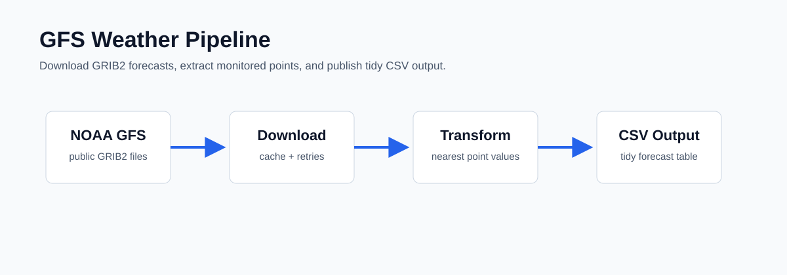

# GFS Weather Pipeline

A compact portfolio project that shows how to structure a repository for humans and coding agents first, with a NOAA GFS pipeline as the concrete example.

The emphasis here is not only the weather workflow. It is the repository shape itself:

- `AGENTS.md` for cross-agent operating rules;
- `CLAUDE.md` and `.claude/` for Claude Code behavior;
- `.agents/skills/` for reusable agent workflows;
- `.github/copilot-instructions.md` and `.github/instructions/` for Copilot and GitHub-aware guidance;
- `.github/prompts/` for reusable task prompts;
- a small local GFS pipeline that gives those instructions something real to operate on.

The pipeline downloads a short 72h GFS run, extracts point forecasts, and plots a focused set of maps:

- surface wind speed;
- 2m temperature;
- 500 hPa geopotential height.

It intentionally generates **only five figures per variable** by default (`f000`, `f018`, `f036`, `f054`, `f072`) so the project stays small enough for local review while still showing the full ETL and visualization workflow.



## What It Shows

- NOAA GFS URL construction and forecast-cycle selection.
- GRIB2 download with retries and local caching.
- Point extraction from gridded meteorological data.
- Map plotting for three meteorological products.
- A reproducible CLI workflow.
- A small Docker image for local runs.
- Agent-ready repository conventions for Claude Code, Codex, and GitHub Copilot.

## Agent-Ready Repository

This repository is a small example of how to structure a codebase for multiple AI coding agents.

- `AGENTS.md` is the top-level operating contract. It tells any agent what the repository is for, what not to touch, and how to validate changes.
- `CLAUDE.md` is the Claude-facing entry point. It points Claude Code to the shared rules and keeps the local experience aligned.
- `.claude/rules/` holds Claude-specific behavior rules. Add task-focused rules there when a new workflow needs stricter guidance.
- `.agents/skills/` holds portable skills that describe repeatable agent workflows. In this repo they cover local pipeline preflight and map review, but the same pattern can be copied into another repository and rewritten for data quality checks, deployment review, documentation audits, or domain-specific debugging.
- `.github/copilot-instructions.md` is the Copilot-facing context file. It helps Copilot stay consistent with the local-first scope.
- `.github/instructions/` is where GitHub-oriented guidance lives. Use it for reusable instructions that should apply across reviews, prompts, and agent workflows.
- `.github/prompts/` stores reusable prompts for recurring tasks, such as pipeline debugging and plotting fixes.

The point is to make the repository readable to humans and agents, so Claude, Codex, and Copilot all receive the same expectations: local execution, no secrets, no generated data in git, and a narrow GFS plotting scope.

There are deliberately **no GitHub Actions workflows** here. This portfolio repo is about local execution and agent collaboration patterns, not CI/CD.

## How To Reuse It

If you want to turn this into your own agent-friendly repo, copy the structure and then rename the instruction files to match your project.

1. Clone or fork the repository into your own GitHub account.
2. Rename the repo for your goal, for example `my-agent-playground` or `my-weather-pipeline`.
3. Update `README.md` first so the human-facing story matches your new use case.
4. Edit `AGENTS.md` to describe your scope, guardrails, and validation commands.
5. Edit `CLAUDE.md` and `.claude/rules/` if you want Claude-specific behavior or task rules.
6. Edit `.agents/skills/` to describe repeatable agent workflows that matter for your project.
7. Edit `.github/copilot-instructions.md` so Copilot sees the same constraints.
8. Add or replace prompts in `.github/prompts/` for recurring jobs in your repo.
9. Keep the structure stable and add task-specific instructions instead of scattering policy into random notes.

For new tasks, create a new rule, prompt, or skill rather than overloading the existing ones. For example, if you add another pipeline, create a task-specific prompt and a concise rule for that pipeline instead of expanding the GFS instructions until they cover everything.

## Repository Layout

```text
src/gfs_pipeline/
  cli.py          Command-line interface
  config.py       Environment and runtime settings
  noaa.py         GFS URL building and file download
  transform.py    GRIB-to-point transformation
  plotting.py     Map plotting for the three portfolio variables
  pipeline.py     End-to-end orchestration
config/
  points.csv      Example monitored locations
examples/
  sample_forecast.csv
.claude/          Claude Code rules
.agents/          Portable agent skills
.github/          Copilot instructions and reusable prompts
AGENTS.md         Cross-agent operating guide
```

## Quick Start

Install locally:

```bash
python -m venv .venv
.venv\Scripts\activate
pip install -e .
```

On Linux/macOS, activate with:

```bash
source .venv/bin/activate
```

Download the compact 72h GFS set:

```bash
gfs-pipeline download-72h --date 20260501 --cycle 00
```

Plot the three map products:

```bash
gfs-pipeline plot-maps --date 20260501 --cycle 00
```

The plotting step creates 15 PNG files in total and may take a little longer than the CSV extraction step.

Run a single point-extraction CSV:

```bash
gfs-pipeline run --date 20260501 --cycle 00 --forecast-hour 6
```

## CLI Commands

Download five forecast steps through 72h:

```bash
gfs-pipeline download-72h --date 20260501 --cycle 00
```

Plot five figures per variable:

```bash
gfs-pipeline plot-maps --date 20260501 --cycle 00 --output-dir data/maps
```

Extract monitored-point values for one forecast hour:

```bash
gfs-pipeline run \
  --date 20260501 \
  --cycle 00 \
  --forecast-hour 6 \
  --points config/points.csv \
  --output-dir data/processed
```

## Docker

```bash
docker build -t gfs-pipeline .
docker run --rm -v "%cd%/data:/app/data" gfs-pipeline download-72h --date 20260501 --cycle 00
docker run --rm -v "%cd%/data:/app/data" gfs-pipeline plot-maps --date 20260501 --cycle 00
```

On Linux/macOS:

```bash
docker run --rm -v "$PWD/data:/app/data" gfs-pipeline download-72h --date 20260501 --cycle 00
docker run --rm -v "$PWD/data:/app/data" gfs-pipeline plot-maps --date 20260501 --cycle 00
```

## Example CSV Output

```csv
run_date,cycle,forecast_hour,point_name,latitude,longitude,variable,value,unit
20260501,00,6,Sao Paulo,-23.55,-46.63,t2m,292.1,K
20260501,00,6,Sao Paulo,-23.55,-46.63,tp,0.8,mm
```

See [examples/sample_forecast.csv](examples/sample_forecast.csv).

## Notes

This is a portfolio-friendly version of a larger operational meteorological ingestion system. It keeps the public repository focused on one reproducible model, one short run, three map products, and agent-friendly project instructions.
