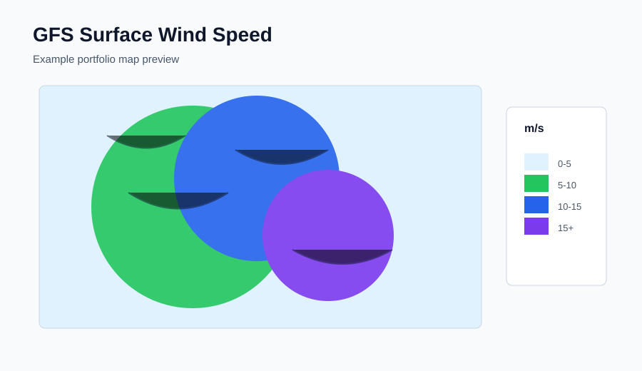
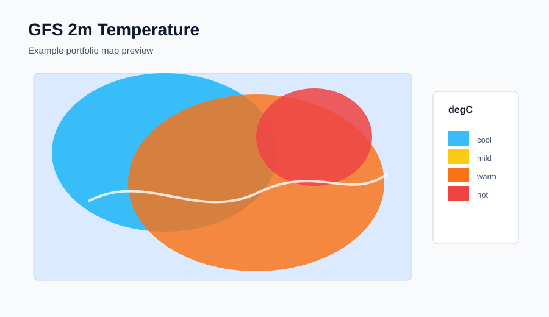
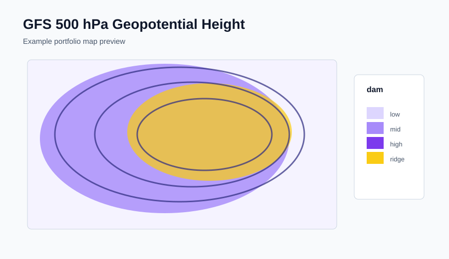

# GFS Weather Pipeline

A compact portfolio project that demonstrates a local meteorological pipeline for the **NOAA Global Forecast System (GFS)**.

The repository downloads a short 72h GFS run, extracts point forecasts, and plots a focused set of maps:

- surface wind speed;
- 2m temperature;
- 500 hPa geopotential height.

It intentionally generates **only five figures per variable** by default (`f000`, `f018`, `f036`, `f054`, `f072`) so the project stays small enough for local review while still showing the full ETL and visualization workflow.


## What It Shows

- NOAA GFS URL construction and forecast-cycle selection.
- GRIB2 download with retries and local caching.
- Point extraction from gridded meteorological data.
- Map plotting for three meteorological products.
- A reproducible CLI workflow.
- A small Docker image for local runs.
- Agent-ready repository conventions for Claude Code, Codex, and GitHub Copilot.

## Map Examples

These are lightweight portfolio previews. Real PNG maps are generated locally from downloaded GFS GRIB2 files.

| Surface wind | 2m temperature | 500 hPa geopotential |
|---|---|---|
|  |  |  |

Generated maps are written to:

```text
data/maps/surface_wind/
data/maps/temperature_2m/
data/maps/geopotential_500hpa/
```

## Agent-Ready Repository

This repository is also a small example of how to structure a codebase for multiple AI coding agents.

- `AGENTS.md` gives Codex and other agents the project scope, guardrails, and validation commands.
- `CLAUDE.md` and `.claude/rules/` give Claude Code concise local rules.
- `.github/copilot-instructions.md` and `.github/instructions/` guide GitHub Copilot and agentic GitHub tooling.
- `.github/prompts/` stores reusable review prompts.

The point is not to add automation for its own sake. The point is to make the repository readable to humans and agents, so Claude, Codex, and Copilot all receive the same expectations: local execution, no secrets, no generated data in git, and a narrow GFS plotting scope.

There are deliberately **no GitHub Actions workflows** here. This portfolio repo is about local execution and agent collaboration patterns, not CI/CD.

## Repository Layout

```text
src/gfs_pipeline/
  cli.py          Command-line interface
  config.py       Environment and runtime settings
  noaa.py         GFS URL building and file download
  transform.py    GRIB-to-point transformation
  plotting.py     Map plotting for the three portfolio variables
  pipeline.py     End-to-end orchestration
config/
  points.csv      Example monitored locations
examples/
  sample_forecast.csv
.claude/          Claude Code rules
.github/          Copilot instructions and reusable prompts
AGENTS.md         Cross-agent operating guide
```

## Quick Start

Install locally:

```bash
python -m venv .venv
.venv\Scripts\activate
pip install -e .
```

On Linux/macOS, activate with:

```bash
source .venv/bin/activate
```

Download the compact 72h GFS set:

```bash
gfs-pipeline download-72h --date 20260501 --cycle 00
```

Plot the three map products:

```bash
gfs-pipeline plot-maps --date 20260501 --cycle 00
```

The plotting step creates 15 PNG files in total and may take a little longer than the CSV extraction step.

Run a single point-extraction CSV:

```bash
gfs-pipeline run --date 20260501 --cycle 00 --forecast-hour 6
```

## CLI Commands

Download five forecast steps through 72h:

```bash
gfs-pipeline download-72h --date 20260501 --cycle 00
```

Plot five figures per variable:

```bash
gfs-pipeline plot-maps --date 20260501 --cycle 00 --output-dir data/maps
```

Extract monitored-point values for one forecast hour:

```bash
gfs-pipeline run \
  --date 20260501 \
  --cycle 00 \
  --forecast-hour 6 \
  --points config/points.csv \
  --output-dir data/processed
```

## Docker

```bash
docker build -t gfs-pipeline .
docker run --rm -v "%cd%/data:/app/data" gfs-pipeline download-72h --date 20260501 --cycle 00
docker run --rm -v "%cd%/data:/app/data" gfs-pipeline plot-maps --date 20260501 --cycle 00
```

On Linux/macOS:

```bash
docker run --rm -v "$PWD/data:/app/data" gfs-pipeline download-72h --date 20260501 --cycle 00
docker run --rm -v "$PWD/data:/app/data" gfs-pipeline plot-maps --date 20260501 --cycle 00
```

## Example CSV Output

```csv
run_date,cycle,forecast_hour,point_name,latitude,longitude,variable,value,unit
20260501,00,6,Sao Paulo,-23.55,-46.63,t2m,292.1,K
20260501,00,6,Sao Paulo,-23.55,-46.63,tp,0.8,mm
```

See [examples/sample_forecast.csv](examples/sample_forecast.csv).

## Notes

This is a portfolio-friendly version of a larger operational meteorological ingestion system. It keeps the public repository focused on one reproducible model, one short run, three map products, and agent-friendly project instructions.
